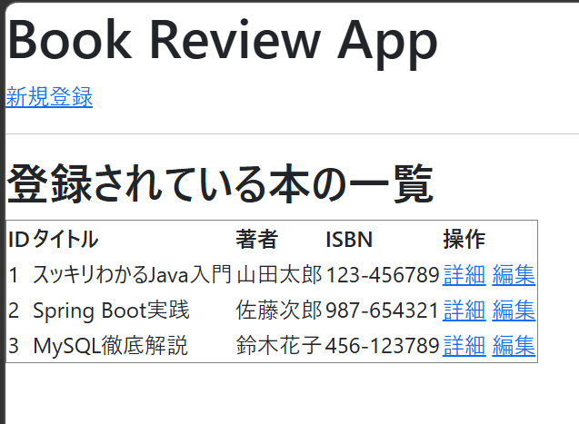
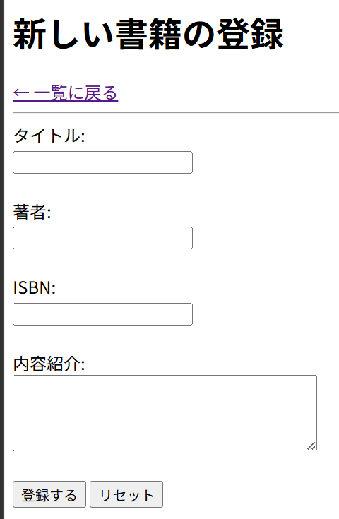

# BookReview　アプリ
本の管理とレビュー投稿ができるWebアプリケーションです。

## スクリーンショット
* 
* 
*
## 機能一覧
* 書籍の一覧表示・詳細閲覧
* 新しい書籍の登録・既存情報の編集
* 書籍に対するレビュー投稿機能（5段階評価とコメント）

## 使用技術
### バックエンド (Backend)
- **Java**: 21 (最新の長期サポート版)
- **Spring Boot**: 4.0.2
    - **Spring MVC**: Webアプリケーション構築
    - **Spring Data JPA**: データベース操作（ORM）
    - **Spring Boot Validation**: 入力値のバリデーション
- **Lombok**: アノテーションによるボイラープレートコードの削減

### フロントエンド (Frontend)
- **Thymeleaf**: テンプレートエンジンによる動的HTML生成
- **HTML5 / CSS3**: UIデザイン

### データベース / ツール (Database & Tools)
- **H2 Database**: インメモリ型データベース（開発・テスト用）
- **Maven**: プロジェクト管理・ビルドツール
- **Spring Boot DevTools**: 開発中のオートリロード機能